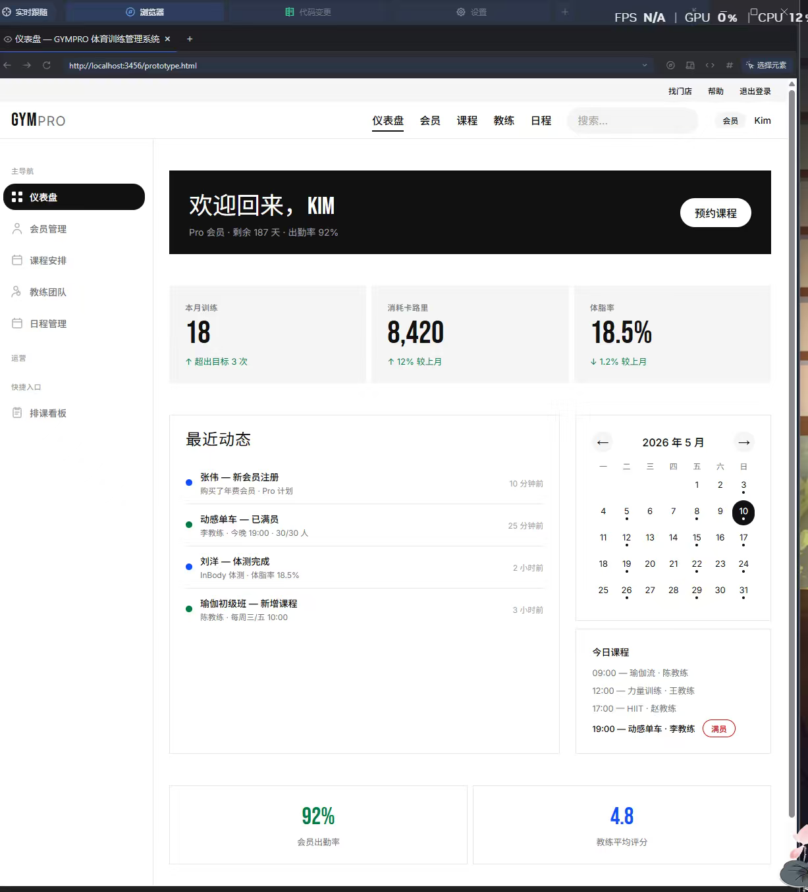

# Gym-Management-System

这个本来是给别人大创项目写的，但是人家半路跑路了，所以挂在上面大家自由取用。

这是一个仿耐克官网风格的管理系统，登录注册逻辑我帮你写好了，数据库用的是 MySQL，数据库管理你就用 Navicat 17。

文件有点杂乱，但是有 PRD 文档，后期可以拿 AI 整理一下（不过劝你最好拿到手就改好哦）。

## 快速开始

1. 用 Navicat 17 导入 `db-init.sql` 创建数据库
2. 修改 `server.js` 中的数据库连接配置
3. `npm install`
4. `npm start`